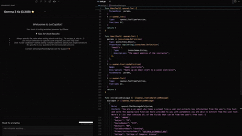
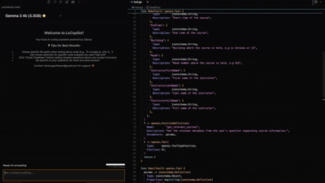

# LoCopilot - Open Source Locally-Running AI Copilot

## 🎬 Features in Action

### Code Selection & AI Assistance


### Project Analysis with Codebase Crawling


## ✨ Features
- ### 🤖 Local LLM Coding Assistant
* Latest open-source reasoning models from DeepSeek, Google, Meta, Qwen, Microsoft...
* Model switching without context loss
* Thought streaming
- ### Advanced Context Loading
* Opened files are automatically added to context
* LoCopilot can see user selected text
* "Crawl Codebase" feature to include your project files in AI context
* Context meter to visualize token usage

  
## 🚀 Getting Started
Install Ollama from the download link: <a href="https://ollama.com/download">https://ollama.com/download</a>

Alternatively, install Ollama using terminal commands:

**macOS:**
```bash
brew install ollama
```

**Linux:**

For most Linux distributions, you can use the official install script:
```bash
curl -fsSL https://ollama.com/install.sh | sh
```

If you encounter permission issues, try with sudo:
```bash
curl -fsSL https://ollama.com/install.sh | sudo sh
```

After installation, you may need to start the Ollama service:
```bash
sudo systemctl start ollama
```

For systems without curl, use wget:
```bash
wget -qO- https://ollama.com/install.sh | sh
```

**Windows:**

Windows installation requires downloading and running the installer:

1. Download the installer:
```powershell
Invoke-WebRequest -UseBasicParsing "https://ollama.com/download/ollama-installer.exe" -OutFile "$env:TEMP\ollama-installer.exe"
```

2. Navigate to your `%TEMP%` folder and run the `ollama-installer.exe` file
3. Follow the installation wizard
4. After installation, you may need to restart VS Code for the extension to detect Ollama

The LoCopilot extension can also help install Ollama for you with the appropriate method for your operating system.

**Windows Subsystem for Linux (WSL):**

When using LoCopilot in WSL, you have two options:

1. **Install Ollama natively in WSL (Recommended)**:
   ```bash
   # Install Ollama in your WSL environment
   curl -fsSL https://ollama.com/install.sh | sh
   
   # If you encounter permission issues, try:
   curl -fsSL https://ollama.com/install.sh | sudo sh
   
   # Start the Ollama service
   sudo systemctl start ollama
   ```

2. **Access your Windows Ollama installation from WSL**:
   - First install Ollama for Windows using the Windows installer
   - In WSL, access it via the Windows path converted to WSL format:
   ```bash
   # Make it executable if needed
   chmod +x /mnt/c/Users/YOUR_USERNAME/AppData/Local/Programs/Ollama/ollama.exe
   
   # Run commands directly
   /mnt/c/Users/YOUR_USERNAME/AppData/Local/Programs/Ollama/ollama.exe pull gemma3:4b
   ```

**Troubleshooting WSL**:
- If you see `zsh: command not found` errors, you're likely seeing Windows commands being sent to a Linux shell
- In this case, close VS Code, restart, and use the WSL-specific installation option
- You can also open Windows Explorer from WSL with `explorer.exe .` and download Ollama manually

LoCopilot will detect if you're running in WSL and provide appropriate installation instructions.

## 💡 Next Steps
After installing Ollama, be sure to install at least 1 model before running the extension.

Select from one of the available models (⭐ indicates recommended models):
- CodeLlama instruct (3.8GB) ⭐
- Gemma 3 4b (3.3GB) ⭐ - *Default model*
- DeepSeek R1 8b (4.9GB) ⭐
- CodeLlama 13b (8.2GB)
- CodeLlama 34b (21GB)
- Gemma 3 27b (17GB)
- DeepSeek R1 70b (43GB)
- QwQ (20GB)

### 📝 Example (default model: Gemma 3 4b)
```
ollama pull gemma3:4b
```

## 📋 How to Use
1. Install and launch the extension
2. Click "Crawl Codebase" to help the AI understand your project structure
3. When asking questions, always specify file paths for more accurate responses
4. Use mouse selection to get help with specific code snippets

## ❤️ Support
For any issues with the extension, reach out to us directly at rainsongsoftware@gmail.com

